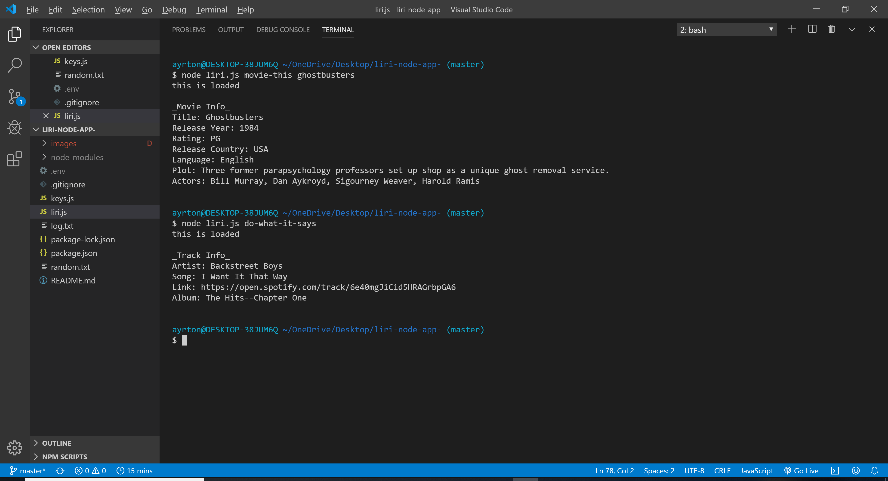

*Uses for LIRI Bot*

For this assignment, I created a LIRI. The LIRIbot operates like the iPhone’s SIRI operating system/app. Unlike Siri though, which is a Speech Recognition Interface. This LIRI-bot acts as a Language Recognition Interface. Also, LIRI acts as a command line node app that accepts parameters and retursn specific data back to the user.

You can use the LIRI bot to search for:
- upcoming concerts using the command: concert-this "insert artist you want to search"
- upcoming concerts using the command: concert-this "insert artist you want to search" 
- movie information using the command: movie-this "insert movie you want to search"
- song information using the command: spotify-this-song "insert song you want to search"
Also note that a user will need to use quotations when searching for artists movies, and songs longer than 1 word.

Examples are listed: See [Images 1] for example of movie-this and do-what-it-says
         See [Images 2] for example of spotify-this-song and concert-this

* Below is a list of specific tecnologie a user will need to get started with Liri Bot*
these include Node packages to get started:
- Node-Spotify-API
- Axios
- Moment
- DotEnv
You'll need keys for these APIs
- BandsinTown API 
- Spotify API
- OMDB API

Matthw Ayrton, University of Utah Coding Bootcamp (https://github.com/mayrton1/liri-node-app-)

I created this program from start to finish using the technologies (liste above)

**Images**

-image 1

-image 2

